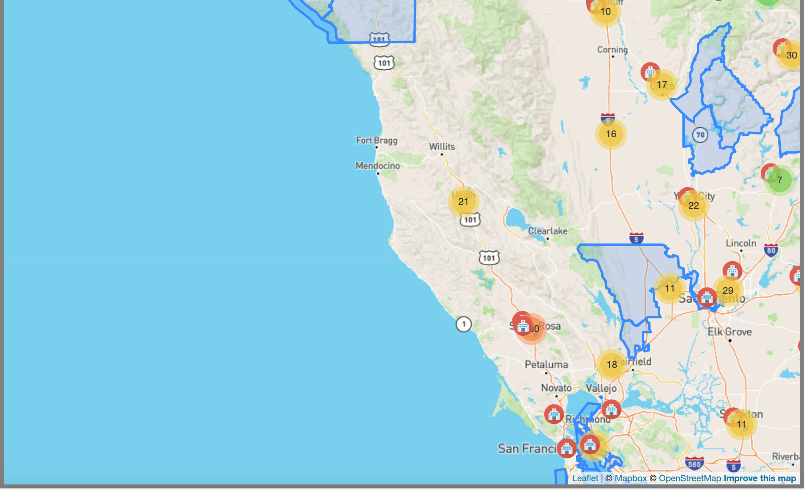

OVERVIEW:
In this project, we wanted to find out how many Californians were living below the living wage, and what services were available for them publicly, especially health services.  

GROUP PROJECT MEMBERS:
Saki Sugiura, Belinda Soerjohadi, Usha Chari

DATA SOURCES WE USED:

Healthcare Services Visualization project for Low Income Households :

DATA SOURCES WE USE:
<!-- low income providers -->
https://data.ca.gov/dataset/directory-of-service-providers1/resource/2b77a934-7425-4539-9caf-fa05bbabbe59
saved as: medical_county (JSON)

<!-- medically underserved areas -->
https://data.chhs.ca.gov/dataset/medically-underserved-areas
saved as: Medically_Underserved_Areas (GEOJSON)

<!-- low income -->
https://data.chhs.ca.gov/dataset/living-wage/resource/f5a57e7a-e0fe-4d80-b0f6-92d66ecb907f
saved as: hci_living_wage_full_data (xlsx)
cleaned as: cleaned_lowincome (CSV)
cleaned as: cleaned_lowincomegrouped (CSV)

FEATURES:
    Mapbox, Plotly, Filter table:
    All using data we found on above sources and saved database through pgAdmin (for csv files) and mongoDB for (JSON/GeoJSON files) all ran through Flask.
    
LANGUAGES/INSTALLATONS:  
    Python
    JavaScript
    HTML
    Flask
    Bootstrap 
    Leaflet
    Mapbox
    Marker Cluster 
    Plotly
    D3 
    Choropleth  

NOTE:
    API key - please add your mapbox API key in the "config.js" file

STEPS -

1. Run "data_cleanup.ipynb" file in Jupyter Notebook to clean up data and upload to our database (pgAdmin and mongoDB).
** within this document, we added a note with codes to run in pgAdmin**

<!-- # CREATE USER admin22 with Password '12345'
# Alter User admin22 With SuperUser;

# IF EXISTS(SELECT *
#           FROM   dbo.Healthcare_LowIncome)
#   DROP TABLE dbo.low_income
#   DROP TABLE dbo.low_income_race

# CREATE TABLE low_income(
# 	County VARCHAR PRIMARY KEY,
# 	Families_Below_the_Living_Wage INT,
# 	Number_of_Families INT,
# 	Living_Wage INT,
# 	Percent_of_Families_Below_the_Living_Wage INT
# );

# CREATE TABLE low_income_race(
# 	Race VARCHAR,
# 	County VARCHAR,
# 	Families_Below_the_Living_Wage INT,
# 	Number_of_Families INT,
# 	Living_Wage INT,
# 	Percent_of_Families_Below_the_Living_Wage INT,
# 	FOREIGN KEY (County) REFERENCES low_income(County)
# ); -->

2. Run "app.py" file in a terminal

3. Open local host in chrome browser:
http://127.0.0.1:5000/

